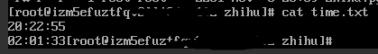
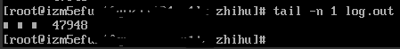

# Python_study
Python小程序
---
**/zhihu_spider/zhihu.py** 下载知乎回答图片，有哪些逼格很高的头像？原链接：https://www.zhihu.com/question/26541011  

云服务器后台执行脚本：nohup python3 -u zhihu.py > log.out 2>&1 &  

运行时间如下图：  
  

下载图片总数：  

